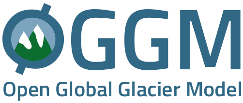

Initialization of past glacier states
--------------------------------------

The reconstruction of past glacier mass changes is of interest for different applications, e.g. for quantifying their
contribution to sea-level change. We here present a new initialization method of past glacier states based on the Open
Global Glacier Model (`OGGM <https://oggm.org/>`_). This repository host the new method which estimates past glacier
states based on present day geometry and past climate information only. This method is published in
`Eis et al. 2019 <https://www.the-cryosphere.net/13/3317/2019/tc-13-3317-2019.html>`_.

Our method consists of 3 steps and the workflow is shown in the following figure:

- generation of possible glacier states,
- identification of glacier candidate staes, and
- their evaluation based on the misfit between the modelled and the observed geometry in the year of the observation.

.. image:: _figures/workflow.png

The current version was tested on glaciers located in the Alps and we reconstruct their state in 1850 by using synthetic
experiments. Thus the reconstructed glacier states did not represent the reality and need to be handled with caution.

A further development that will also allow the application to real-world cases is under development and a new manuscript
will be published soon.

In most cases, the resulting reconstruction is non-unique, as multiple initial states
converge towards the observed state in the year of observation.

Installation
------------

You can install this custom package with::

     pip install git+https://github.com/OGGM/initialization.git

However, what you'd probably like to do is to `fork <https://help.github.com/articles/fork-a-repo/>`_ this repository and use
it as a template for your own project. You can install it locally with::

    pip install -e .

Usage
-----
How to use this method is explained in jupyter notebooks which can be found in the `example`_ directory.
You will find there an example based on synthetic experiments, as well as an example explaining the further development
for zhe handling of real-world cases.
The usage of our method takes some time (hundreds of OGGM simulations are required to find possible glacier states for
ONE year), and we recommend to use a super-computer environment for the reconstruction of multiple glaciers, as the
simulations can run in parallel.

Get in touch
------------

- View the source code `on GitHub`_.
- Report bugs or share your ideas on the `issue tracker`_.
- Improve the model by submitting a `pull request`_.
- Or you can always send us an `e-mail`_ the good old way.

.. _e-mail: jeis@uni-bremen.de
.. _on GitHub: https://github.com/OGGM/initialization
.. _issue tracker: https://github.com/OGGM/initialization/issues
.. _pull request: https://github.com/OGGM/initialization/pulls
.. _example: https://github.com/OGGM/initialization/tree/master/examples
